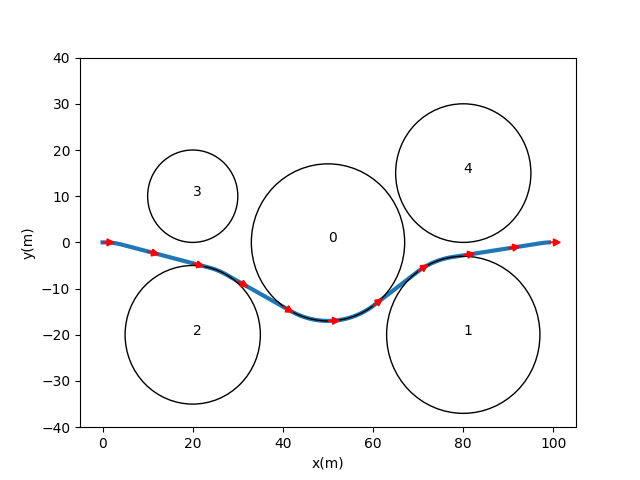

# 2D Collision Avoidance Trajectory Planning with MI-SOCP
An unofficial python implementation of artical:

[Zhang, Guoxu, and Xinfu Liu. "UAV Collision Avoidance Using Mixed-Integer Second-Order Cone Programming." Journal of Guidance, Control, and Dynamics 45.9 (2022): 1732-1738.](https://www.researchgate.net/publication/360330736_UAV_Collision_Avoidance_Using_Mixed-Integer_Second-Order_Cone_Programming)



## Requirements
Python >= 3.7, numpy, matplotlib, yacs, cvxpy, ecos, (Mosek, etc.)

## Running
You can modify configuration in `config.py`.

To run with Alg 1
```bash
python solve --alg 1
```
